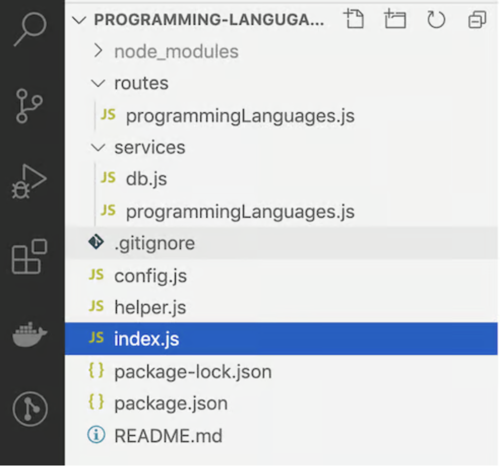

# SQL Node Codalong

### Introduction

In this tutorial, we’ll learn how to build a REST API using MySQL as our database and Node.js as our language.

### Learning Objectives

Students should get **hands-on experience** with:

- Understanding REST Principles 
- HTTP Methods and CRUD Operations
- Connecting to a SQL database
- Building a fully functional backend system for user interactions

### Creating the Database

Follow the below steps and you'll be ready to get going on the codealong!

1. To host our testing MySQL 8.0 database, we’ll use db4free.net. First, go to the db4free signup page, then fill out the required details by choosing your database name and username.
2. Click on Signup, and you should receive a confirmation email. Confirm your account by clicking on the link in the email. Next, on the sidebar, click on phpMyAdmin. In the phpMyAdmin login, enter the username and password you chose and click Go.
3. Now, we have an empty database. Let’s add the programming_languages table. First, click on the database name on the left; for me, it was restapitest123. Then, click SQL on the top menu, and put the following code for CREATE TABLE in the text area:

``` sql

CREATE TABLE `programming_languages`
(
  `id`            INT(11) NOT NULL auto_increment ,
  `name`          VARCHAR(255) NOT NULL ,
  `released_year` INT NOT NULL ,
  `githut_rank`   INT NULL ,
  `pypl_rank`     INT NULL ,
  `tiobe_rank`    INT NULL ,
  `created_at`    DATETIME NOT NULL DEFAULT CURRENT_TIMESTAMP ,
  `updated_at`    DATETIME on UPDATE CURRENT_TIMESTAMP NOT NULL DEFAULT CURRENT_TIMESTAMP ,
  PRIMARY KEY (`id`),
  UNIQUE `idx_name_unique` (`name`(255))
)
engine = innodb charset=utf8mb4 COLLATE utf8mb4_general_ci;

```

4. Click the Go button to run the query.
5. The code will return with a green check box and a message along the lines of MySQL returned an empty result set (i.e. zero rows). With that, we’ve created a table called programming_languages with eight columns and a primary key called id, an internet and auto-increment. The name column is unique, and we also added released_year for the programming language. We have three columns to input the rank of the programming language (GitHut: GitHub language stats for Q4 2020, PYPL: The Popularity of Programming Language Index, TIOBE index) The created_at and updated_at columns store dates to keep track of when the rows were created and updated.
6. Next, we’ll add 16 popular programming languages to our programming_languages table. Click the same SQL link on the top of the page and add the code below:

``` sql

INSERT INTO programming_languages(id,name,released_year,githut_rank,pypl_rank,tiobe_rank) 
VALUES 
(1,'JavaScript',1995,1,3,7),
(2,'Python',1991,2,1,3),
(3,'Java',1995,3,2,2),
(4,'TypeScript',2012,7,10,42),
(5,'C#',2000,9,4,5),
(6,'PHP',1995,8,6,8),
(7,'C++',1985,5,5,4),
(8,'C',1972,10,5,1),
(9,'Ruby',1995,6,15,15),
(10,'R',1993,33,7,9),
(11,'Objective-C',1984,18,8,18),
(12,'Swift',2015,16,9,13),
(13,'Kotlin',2011,15,12,40),
(14,'Go',2009,4,13,14),
(15,'Rust',2010,14,16,26),
(16,'Scala',2004,11,17,34);

```

7. You should receive a message like “16 rows inserted.” Then, the data from our three sources is collected and added to the table in bulk by the INSERT statement, creating 16 rows, one for each programming language. We’ll return to this when we fetch data for the GET API endpoint. If we click on the programming_languages table, visible on the left, we’ll see the rows that we just added.

### Creating the API

1. In the terminal, navigate into the codealong's root directory. Be sure you're not in any sub-directory. You want to be in `sql-node-library`.
2. Still in the terminal, run `npm init -y` to initialize the package.json.
3. Run the following command, `npm install express` to add Express.
4. Create file named `index.js`
5. Still in the terminal, cd into your src folder and run `node app.js`. (See the below "Starting Point" section.)
6. Initalize the app.js with the following code:

``` javascript

const express = require("express");
const app = express();
const port = 3000;
app.use(express.json());
app.use(
  express.urlencoded({
    extended: true,
  })
);
app.get("/", (req, res) => {
  res.json({ message: "ok" });
});
app.listen(port, () => {
  console.log(`Example app listening at http://localhost:${port}`);
});

```

7. Create the following file structure



### Linking the DB and the API
1. We will need to link our Node.js server with MySQL to create our GET programming languages API. We’ll use the mysql2 package to interact with the MySQL database.
2. First, we need to install mysql2 using the command below at the project root directory: `npm i mysql2`
3. Next, we’ll create the config file on the root of the project with the following contents:

``` javascript

const config = {
  db: {
    /* don't expose password or any sensitive info, done only for demo */
    host: "db4free.net",
    user: "restapitest123",
    password: "restapitest123",
    database: "restapitest123",
    connectTimeout: 60000
  },
  listPerPage: 10,
};
module.exports = config;

```
4. Next, we’ll create the helper.js file to help with pagination. We only want to get a certain numbers of responses at a time. This function helps us with that, and we can use it over and over. Use this code in your `helper.js` file.

``` javascript
function getOffset(currentPage = 1, listPerPage) {
  return (currentPage - 1) * [listPerPage];
}

function emptyOrRows(rows) {
  if (!rows) {
    return [];
  }
  return rows;
}

module.exports = {
  getOffset,
  emptyOrRows
}
```

5. Now, let's write the code that connects us to the database. In the services/db.js file, add the following code:

``` javascript
const mysql = require('mysql2/promise');
const config = require('../config');

async function query(sql, params) {
  const connection = await mysql.createConnection(config.db);
  const [results, ] = await connection.execute(sql, params);

  return results;
}

module.exports = {
  query
}
```

6. Now, we’ll write up the `services/programmingLanguages.js` file that acts as the bridge between the route and the database:

``` javascript
const db = require('./db');
const helper = require('../helper');
const config = require('../config');

async function getMultiple(page = 1){
  const offset = helper.getOffset(page, config.listPerPage);
  const rows = await db.query(
    `SELECT id, name, released_year, githut_rank, pypl_rank, tiobe_rank 
    FROM programming_languages LIMIT ${offset},${config.listPerPage}`
  );
  const data = helper.emptyOrRows(rows);
  const meta = {page};

  return {
    data,
    meta
  }
}

module.exports = {
  getMultiple
}
```

7. After that, we’ll create the routes file in `routes/programmingLanguages.js`, which looks like the following:

```javascript
const express = require('express');
const router = express.Router();
const programmingLanguages = require('../services/programmingLanguages');

/* GET programming languages. */
router.get('/', async function(req, res, next) {
  try {
    res.json(await programmingLanguages.getMultiple(req.query.page));
  } catch (err) {
    console.error(`Error while getting programming languages `, err.message);
    next(err);
  }
});

module.exports = router;
```

8. Now we need to update our `index.js`

``` javascript
const express = require("express");
const app = express();
const port = 3000;
const programmingLanguagesRouter = require("./routes/programmingLanguages");
app.use(express.json());
app.use(
  express.urlencoded({
    extended: true,
  })
);
app.get("/", (req, res) => {
  res.json({ message: "ok" });
});
app.use("/programming-languages", programmingLanguagesRouter);
/* Error handler middleware */
app.use((err, req, res, next) => {
  const statusCode = err.statusCode || 500;
  console.error(err.message, err.stack);
  res.status(statusCode).json({ message: err.message });
  return;
});
app.listen(port, () => {
  console.log(`Example app listening at http://localhost:${port}`);
});

```


### Testing

Now we get to test our application with Postman!

For your lab, you will build on this project by adding a POST for adding a new language and a DELETE for removing a language. 
